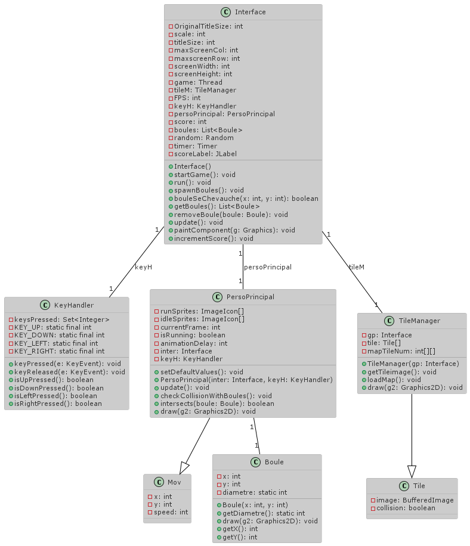
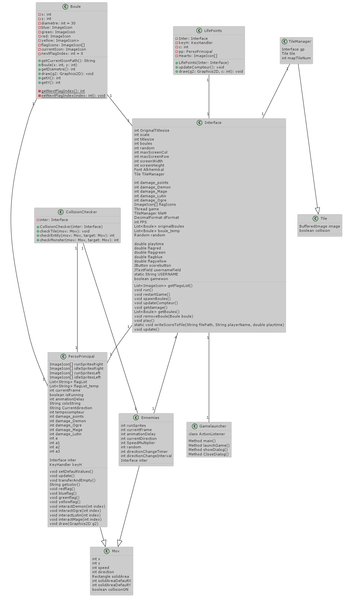
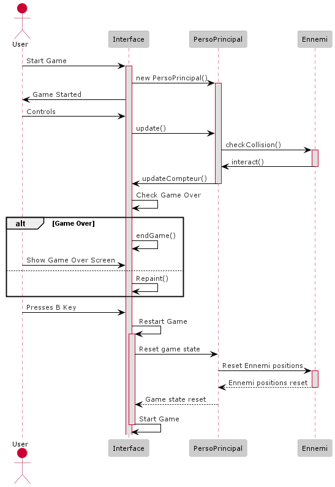

# **FlagQuest**

        AMRANI Hamza
        EL MOUNA Abdellahi
        BOULAAID Amal
        NOURI Nada
        

## Maven

* cp target/ISN-powerrangers-0.0.1-SNAPSHOT.jar

* model.GameLauncher
  *********
## Backlog General

* Le personnage principal dispose de trois vies.
* Déplacement des monstres dans l'interface et dans les quatre sens ( haut, bas , gauche , droit )
* Mouvement du personnage principal dans l'interface et dans les quatre sens ( haut , bas , gauche , droit ).
* Le personnage principale consomme des boules colorées qui lui sont exclusives ,chaque boule colorée permet de tuer un monstre de même couleur .
* Lorsque le personnage principal mange la boule colorée, un marquage de la boule mangée apparait.
* Le Monstre tue le personnage principal .
* Le score est évalué en se basant sur le temps que le personnage principal met pour tuer tous les monstres.
* Lorsque le personnage principal consomme la boule colorée, il est doté d'un délai limité pour éliminer le monstre.
* Après un délai , le personnage redevient vulnérable a tout type de monstre et le marquage disparait.
* A chaque fin de session du jeu , il y aura un affichage des trois derniers meilleurs scores.
* Le joueur saisie son pseudonyme .
* Les boules colorées pop aléatoirement dans l’interface .
* Affichage des 3 derniers meilleurs scores.

## Sprint 2

* [x] Création d’une fenêtre de jeux(Nada)

* [x] Première version de l’interface(Hamza)

* [x] Implementation du gameLOOP(Abdellahi)

* [x] Déplacement du perso principale plus son animation(Amal)

### Sprint review

    Les objectifs du sprint ont été atteints avec succès. La fenêtre de jeu a été créée, l'interface a été conçue dans sa première version, et le boucle de jeu (gameLOOP) a été implémentée. Le déplacement du personnage principal, accompagné de son animation, a également été réalisé.

### Sprint retrospective

    Malgré le bon fonctionnement du jeu, des améliorations peuvent être apportées. Il est recommandé de continuer à peaufiner l'interface et de s'assurer que le déplacement du personnage et son animation sont fluides. Des tests supplémentaires peuvent être effectués pour garantir une expérience utilisateur optimale.
### Diagramme de classe 

### Diagramme de sequence

  ************

## Sprint 3

- [x] Déplacement des monstres dans l'interface et dans les quatre sens. (Nada)

* [x] Les drapeaux colorées pop aléatoirement dans l’interface . (Amal)

* [x] Le personnage principal dispose de trois vies.(Hamza)

* [x] Le Monstre tue le personnage principal.(Abdellahi)
  
### Sprint review

    Toutes les tâches du sprint ont été accomplies avec succès. Les monstres se déplacent maintenant dans toutes les directions de l'interface. Les drapeaux colorés sont générés de manière aléatoire dans le jeu. Le personnage principal a maintenant trois vies, et le monstre peut éliminer le personnage principal.
### Sprint retrospective

    Le sprint s'est avéré fructueux avec toutes les fonctionnalités implémentées. Il est maintenant essentiel de s'assurer que le déplacement des monstres est fluide et que l'apparition des drapeaux est réellement aléatoire. Des tests supplémentaires peuvent être effectués pour garantir que le mécanisme de perte de vie fonctionne correctement. En outre, la coordination entre les différentes fonctionnalités peut être optimisée.
### Diagramme de classe

### Diagramme de sequence 

## Sprint 4

* [X] Le joueur saisie son pseudonyme .(Nada)
* [X] Affichage des 3 derniers meilleurs scores .(Nada)
* [X] Lorsque le personnage principal consomme la boule colorée, il est doté d'un délai limité pour éliminer le monstre.(Amal-Hamza)
* [X] Apres un délai , le personnage redevient vulnérable a tout type de monstre .(Amal)
* [X] Lorsque le personnage principal mange la boule colorée, un marquage de la boule mangée apparaitet le marquage disparait après un délai.(Abdullahi)
* [X] Le score est évalué en se basant sur le temps que le personnage principal met pour tuer tous les monstres.(Hamza)
### Sprint review
    Toutes les fonctionnalités prévues ont été implémentées avec succès. Le joueur peut désormais saisir son pseudonyme, et les trois meilleurs scores sont affichés. Désormais le personnage principal, après avoir consommé la boule colorée, dispose d'un temps limité pour éliminer les monstres. Le score est maintenant évalué en fonction du temps nécessaire pour tuer tous les monstres.
### Sprint retrospective
    Le développement du jeu a atteint son stade final avec la mise en place réussie de toutes les fonctionnalités prévues. Cependant, des difficultés ont émergé lors de la gestion des boules, car cela forçait les joueurs à adopter une stratégie sans retour possible pour terminer le jeu. Une fois qu'une boule était consommée, elle ne réapparaissait pas, plongeant ainsi le joueur dans une impasse s'il n'avait pas éliminé le monstre requis dans le délai imparti, ou s'il avait malencontreusement consommé une autre boule avant d'éliminer le monstre. Par conséquent, la décision a été prise de faire perdre le joueur s'il n'élimine pas le monstre dans le délai imparti.
### Diagramme de classe 

### Diagramme de sequence
>